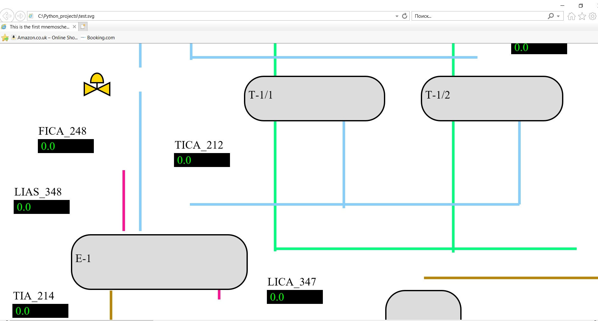

# Программа для автоматизации построения мнемосхем

Данное программное обеспечение позволяет автоматизировать
построение мнемосхем, используя в качестве основы скриншоты
мнемосхем АСУТП. Модель, используйемая в данном ПО, разработана
с помощью TensorFlow и обучена на скриншотах объектов, взятых
к реальных мнемосхем. ПО может работать только с мнемосхемами,
имеющими аналогичный исходным скриншотам вид. Результат обработки
данным ПО скриншота мнемосхемы - это текстовый документ, содержащий
перечень всех обнаруженных объектов (свойства объектов могут быть
отредактированы), линий, а также файл в формате SVG, построенный
и призванный воссоздать мнемосхему в виде, пригодном для воспроизведения
через веб-браузер и для получения данных из тегов с портала базы
данных реального времени нефтеперерабатывающего завода.

## Скриншоты программы
Главное окно программы:

Распознанные объекты на скриншоте обведены цветными рамками (см. ниже).
При этом каждому цвету объектов предназначен свой цвет.

Ниже представлен кусочек сгенерированного текста для файла SVG:

Ниже представлен кусочек сгенерированного текста для файла SVG:

Ниже представлен кусочек сгенерированного текста для файла SVG:

В таком виде хранятся линии мнемосхемы:

А в таком виде хранятся объекты мнемосхемы:

